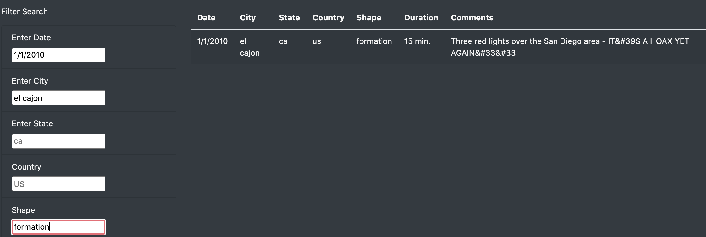

# UFOs

## Objective of Analysis

This analysis takes a look at UFO sightings over the course of several weeks in January of 2010.  The page allows for the user to filter based on date, locations, and shape of the UFO.

## Webpage Functionality

Upon intial landing of the webpage you all of the results available will be displayed in the table.

* There are 5 optional filters allowing for a comprehensive drill down of UFO sightings
  * When entering the filter parameter of your choice you will need to enter the choice in the format that is prefilled (capitalization, spacing)

**Example**

1. Enter Date
   1. 1/1/2010
   2. Press Enter
      1. Results are narrowed down to the above date
2. Enter City
   1. el cajon
   2. Press Enter
      1. Results narrowed further from the previous step
3. Enter Shape
   1. formation
   2. Press Enter
      1. Results narrowed down to one result

## Summary

